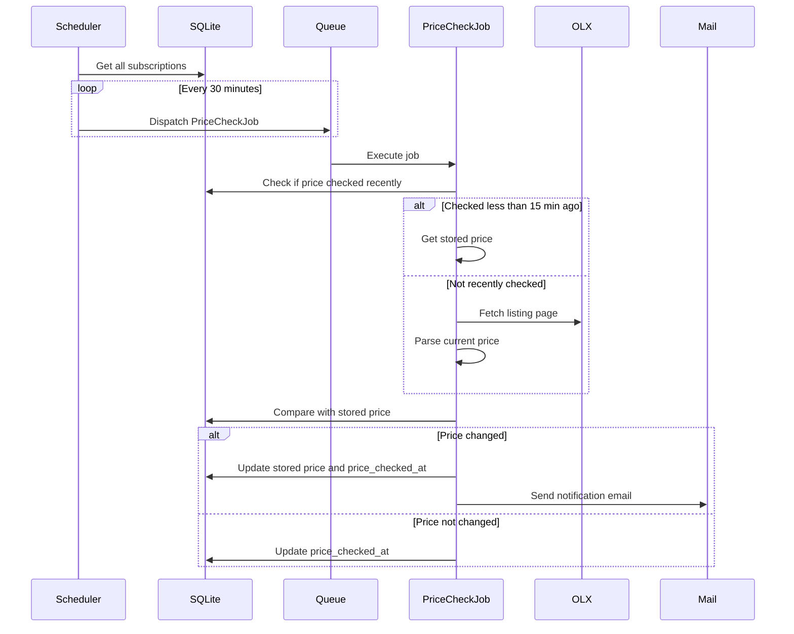

# Price Tracker

Price Tracker is a demo Laravel application that allows users to subscribe to ads on the classifieds site ([olx.ua](https://www.olx.ua)) and receive email notifications whenever a price change is detected.

## Features

- **User Authentication**: Secure registration, login, and password management.
- **Subscription Management**: Add, view, update, and delete subscriptions for specific OLX.ua ads.
- **Price Tracking**: Automatic periodic checks for price changes on subscribed ads.
- **Notifications**: Email alerts sent via Mailpit when a price change occurs.
- **Profile Settings**: Manage profile information, security settings, and appearance (light/dark mode).
- **Responsive Dashboard**: Built with Tailwind CSS and Alpine.js.

## Tech Stack

- **Framework**: [Laravel 12](https://laravel.com)
- **PHP**: 8.4
- **Database**: SQLite (default)
- **Frontend**: [Tailwind CSS](https://tailwindcss.com), [Alpine.js](https://alpinejs.dev)
- **Containerization**: [Laravel Sail](https://laravel.com/docs/12.x/sail) (Docker)
- **Testing**: [Pest](https://pestphp.com)
- **Mail Testing**: [Mailpit](https://github.com/axllent/mailpit)

## Getting Started

### Prerequisites

- [Docker Desktop](https://www.docker.com/products/docker-desktop) installed and running.
- [Composer](https://getcomposer.org/) (optional, if you want to run commands outside Docker).

### Installation

1. **Clone the repository**
   ```bash
   git clone https://github.com/stasgornyak/price-tracker.git
   cd price-tracker
   ```
2. **Ensure Docker is running** 
   
   Start the Docker application on your computer.


3. **Start the containers**
    ```bash
    vendor/bin/sail up -d
    ```

4. **Install PHP dependencies**
   ```bash
   vendor/bin/sail composer install
   ```

5. **Set up environment variables**
   ```bash
   cp .env.example .env
   ```

6. **Generate application key and run migrations**
   ```bash
   ./vendor/bin/sail artisan key:generate
   ./vendor/bin/sail artisan migrate
   ```

7. **Install and build frontend assets**
   ```bash
   ./vendor/bin/sail npm install
   ./vendor/bin/sail npm run build
   ```

The application will be available at `http://localhost:8000` (or `http://localhost` depending on your `.env` configuration).

### Mailpit Dashboard

Mailpit captures all outgoing emails. You can access the dashboard to view notifications at:
`http://localhost:8025`

## Usage

1. **Register** a new account and log in.
2. Navigate to the **Subscriptions** section.
3. Add a new subscription by providing a valid OLX.ua ad URL.
4. The system will automatically check for price updates every 30 minutes (configurable in `config/subscriptions.php`).
5. If the price of the given URL was checked during the last 30/2 = 15 minutes (another subscription with the same URL), then a re-check is not performed.
6. Check your **Mailpit** dashboard for notifications when prices change.

## Diagram



## Running Tests

To run the application's test suite, use the following command:

```bash
./vendor/bin/sail test
```

To measure test coverage, use the following command:
```bash
./vendor/bin/sail test --coverage
```

## Configuration

Tracking intervals and parsers can be configured in `config/subscriptions.php`:

```php
return [
    'parsers' => [
        'olx_ua' => [
            'base_url' => 'https://www.olx.ua',
            'class' => App\Services\Parsers\OlxUaParser::class,
        ],
    ],
    'check_interval_in_minutes' => 30,
];
```

## License

This project is open-sourced software licensed under the [MIT license](https://opensource.org/licenses/MIT).

## Future Development
- [ ] Add localization support.
- [ ] Add price history for each subscription.
- [ ] Add dashboard widgets (price history, statistics, etc.).
- [ ] Add support for other ad sites.
